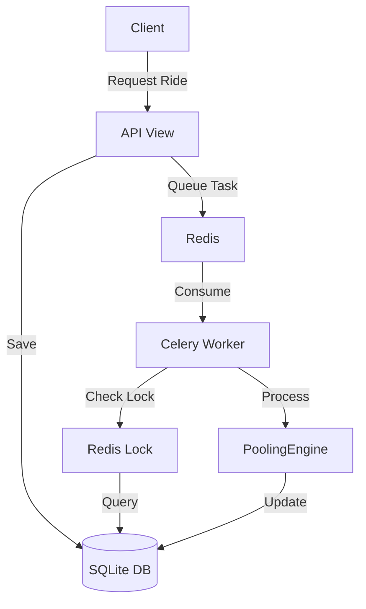

# 🏗️ System Architecture & Data Flow

## 1. High-Level Architecture
```text
[ Mobile / Web Clients ]
         |
         v
    [ Nginx / Gunicorn ]
         |
    [ Django REST Framework ] <-----> [ SQLite DB (WAL Mode) ]
         |
    [ Redis Broker ] <--------------- [ Distributed Locks ]
         |
    [ Celery Workers ]
         |
    +-----------------------+
    |    - Pooling Engine   |
    |    - Route Optimizer  |
    |    - Pricing Engine   |
    +-----------------------+
```

## 2. Pooling Logic Flow
```text
1. User POSTs /api/request-ride/
2. RideRequest created (Status: PENDING)
3. Celery Task `match_pool_task` triggered
4. Engine acquires Redis Lock
5. Search Active Pools (Capacity & Detour Check)
6. If Found:
     - Add to PoolMember
     - Recalculate Stop Sequence
   If Not Found:
     - Find nearest Available Cab
     - Create new Pool
7. Update Status to POOLED
8. Release Lock
```

## 3. Data Flow Diagram


## 4. Cancellation Flow
```text
1. User POSTs /api/cancel-ride/
2. Update RideRequest Status to CANCELLED
3. Find PoolMembership for the ride
4. Delete PoolMembership row
5. Trigger `sync_pool_route_task` for affected Pool
6. Optimizer sorts remaining members by Distance
7. Update `sequence_order` for remaining passengers
```

## 5. Concurrency Flow
```text
Worker A: Acquire(pool_lock_123)
Worker B: Acquire(pool_lock_123) -> Wait
Worker A: DB Select For Update (Members)
Worker A: Create Member
Worker A: Commit & Release Lock
Worker B: Acquire(pool_lock_123) -> Success
Worker B: Re-check Capacity (Updated by A)
```
